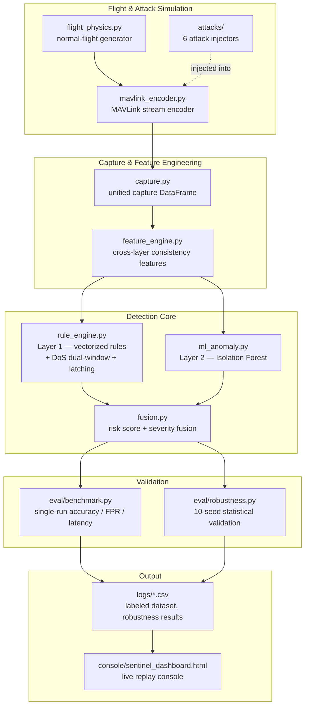

# 🛰️ SENTINEL — Hybrid Drone Intrusion Detection System

<p>


</p>

**SENTINEL** is an indigenous, onboard **Drone Intrusion Detection System (Drone IDS)** built for PUSHPAK Grand Challenge 3 — *Security of Drones* (Techfest, IIT Bombay × VJTI, MeitY-funded). It continuously monitors UAV communication, navigation, and firmware integrity, and detects cyberattacks against a UAV in real time using a **two-layer hybrid detection architecture**: fast, explainable rule-based detectors as the primary layer, backed by an unsupervised ML anomaly detector as a safety net for unknown threats.

[Architecture](#-architecture) • [Key Features](#-key-features) • [Results](#-validated-results) • [Quickstart](#-quickstart) • [Project Structure](#-project-structure) • [Live Console](#-live-console-demo)

---

## ⚡ The Problem

Modern UAV platforms are exposed to a growing set of cyber-physical attacks — spoofed GPS, jammed telemetry links, injected flight commands, tampered firmware — and most existing drone security work is either purely theoretical or focuses on forensics *after* an incident, not real-time defense.

- **Attacks are cross-layer.** A GPS spoof doesn't just corrupt a GPS reading — it desyncs navigation from the flight controller's own state estimate. Detecting it needs a *consistency check*, not a single sensor threshold.
- **Resource-constrained.** A Drone IDS has to run **onboard**, alongside flight control — it cannot assume cloud compute or unlimited power budget.
- **False positives ground the mission.** An IDS that cries wolf on ordinary flight turbulence is as dangerous as one that misses a real attack.

**SENTINEL solves this** by cross-referencing independent telemetry sources (raw GPS vs. fused position, heartbeat cadence vs. message-rate windows, attestation hashes vs. expected firmware) rather than trusting any single stream in isolation — and validates every claim against a reproducible, seeded benchmark.

---

## 🚀 Key Features

### 1. Six-Vector Attack Coverage
Full detection across every attack class named in the Grand Challenge brief:

| Vector | Detection Signal |
|---|---|
| **GPS Spoofing** | Raw GPS vs. EKF/fused-position instantaneous divergence |
| **Telemetry Manipulation** | Fused altitude vs. raw-GPS altitude + implied vertical-speed consistency |
| **DoS / Link Jamming** | Dual-window (1.0s + 0.3s) sparse-traffic detection + heartbeat-gap check |
| **MAVLink Anomaly** | Bad CRC, replayed sequence numbers, unexpected message types |
| **Command Injection** | Unauthorized `system_id` on injected command stream (event-based) |
| **Firmware Integrity** | Cryptographic attestation hash mismatch (event-based) |

### 2. Two-Layer Hybrid Detection
- **Layer 1 — Rule Engine:** explainable, deterministic, near-zero latency (0 ms on 4/6 vectors). Vectorized end-to-end over pandas/numpy — no per-row Python loops.
- **Layer 2 — ML Anomaly (Isolation Forest):** trained only on normal-flight data; catches *unseen* deviations the rule engine's known signatures miss, reported honestly as `unknown_anomaly` rather than a guessed label.
- **Fusion Layer:** rule-confirmed attacks are trusted at full weight; ML-only flags are down-weighted (0.5×) to avoid inheriting the ML layer's higher standalone false-positive rate.

### 3. Reproducible, Seeded Validation
Every number below comes from a **10-seed robustness sweep**, not a single cherry-picked run — `eval/robustness.py` reruns the full simulate → detect → score pipeline on 10 independent random flights and reports mean/std/min/max per metric.

### 4. Live Replay Console
A self-contained, single-file interactive dashboard (`console/sentinel_dashboard.html`) that replays a validated benchmark run against a live onboard-system topology view — see [Live Console Demo](#-live-console-demo).

---

## 🏗 Architecture



**Design principle:** detection features are *cross-layer consistency checks*, not raw thresholds on a single field — e.g. GPS spoofing is caught by comparing raw `GPS_RAW_INT` against the flight controller's independently-fused `GLOBAL_POSITION_INT`, the same class of check a real EKF-based autopilot uses internally.

---

## 📊 Validated Results

10-seed robustness sweep (`eval/robustness.py`):

| Metric | Mean | Std | Min | Max |
|---|---|---|---|---|
| GPS spoofing accuracy | 98.2% | 0.63 | 98.0% | 100.0% |
| Telemetry manipulation accuracy | 99.4% | 0.97 | 98.0% | 100.0% |
| **DoS accuracy** | **86.8%** | **6.97** | 76.2% | 96.3% |
| MAVLink anomaly accuracy | 100.0% | 0.00 | 100.0% | 100.0% |
| Command injection accuracy | 100.0% | 0.00 | 100.0% | 100.0% |
| Firmware integrity accuracy | 100.0% | 0.00 | 100.0% | 100.0% |
| Rule-layer false positive rate | 1.10% | 0.38 | 0.3% | 1.7% |
| Hybrid false positive rate | 2.85% | 0.32 | 2.4% | 3.4% |

**Rule detection latency:** 0 ms (instantaneous) on 4/6 vectors; ~200 ms on DoS (inherent to a rate-based signal — needs a few samples to establish a rate).

**Compute efficiency:** full rule engine over 873 timesteps runs in **~12 ms** (vectorized pandas/numpy — no per-row Python loop), ~9× faster than an equivalent row-by-row implementation.

> DoS is the hardest vector by design — the attack drops messages with `drop_probability=0.9` rather than blocking them deterministically, so individual messages can survive by chance even mid-attack. SENTINEL's dual-window (1.0s + 0.3s) detection plus alert-latching specifically targets this — see `detectors/rule_engine.py` docstrings for the full root-cause writeup.

---

## 🖥 Live Console Demo

`console/sentinel_dashboard.html` is a single self-contained HTML file — no server, no build step — that replays a validated benchmark run against a live onboard-topology view (Ground Control → Telemetry Link → Flight Controller → GPS / IDS Companion / Motor-ESC, plus Firmware Attestation). Trigger any of the 6 attack scenarios to watch the affected node and link highlight in real time, with a live detection event stream (including a "System Healed" entry once an attack clears).

Regenerate it anytime from fresh results with `console/build_dashboard.py` (see below).

---

## 🧰 Quickstart

```bash
# 1. clone / enter the repo
cd drone-ids

# 2. set up environment
python -m venv venv
venv\Scripts\activate        # Windows
# source venv/bin/activate   # macOS/Linux
pip install -r requirements.txt

# 3. generate the labeled synthetic flight dataset (normal + all 6 attacks)
python build_dataset.py

# 4. run the single-pass benchmark (accuracy, FPR, latency, compute time)
python eval\benchmark.py

# 5. run the 10-seed statistical robustness validation
python eval\robustness.py

# 6. (optional) regenerate the live replay console from the latest results
python console\build_dashboard.py
```

All commands are deterministic and seeded — rerunning reproduces the exact numbers in this README.

---

## 📁 Project Structure

```
drone-ids/
├── sim/
│   ├── flight_physics.py       # normal-flight kinematics simulator
│   └── mavlink_encoder.py      # encodes flight records to a MAVLink message stream
├── attacks/
│   ├── base_attack.py          # shared attack-window scaffolding
│   ├── gps_spoofing_attack.py
│   ├── telemetry_manipulation_attack.py
│   ├── dos_attack.py
│   ├── mavlink_anomaly_attack.py
│   ├── command_injection_attack.py
│   └── firmware_integrity_attack.py
├── capture/
│   └── capture.py              # unifies the raw MAVLink stream into one DataFrame
├── features/
│   └── feature_engine.py       # cross-layer consistency features (nav / telemetry / protocol)
├── detectors/
│   ├── rule_engine.py          # Layer 1 — vectorized rule-based detectors + DoS latching
│   └── ml_anomaly.py           # Layer 2 — Isolation Forest anomaly detector
├── fusion/
│   └── fusion.py               # combines both layers into one risk score + severity label
├── eval/
│   ├── benchmark.py            # single-run accuracy / FPR / latency / compute-time report
│   └── robustness.py           # 10-seed statistical validation
├── console/
│   ├── sentinel_dashboard.html # live replay console (self-contained, no server)
│   └── build_dashboard.py      # regenerates the console from the latest results
├── logs/                       # generated datasets + robustness results (git-ignored)
├── build_dataset.py            # end-to-end pipeline entrypoint
├── requirements.txt
└── README.md
```

---

## 🎯 Grand Challenge Alignment

Built directly against the Objective 2 (Drone IDS) evaluation criteria: detection accuracy across attack scenarios, false positive rate, detection latency, coverage of multiple attack vectors, computational efficiency, ease of integration, and documentation/validation — every one of these has a corresponding, reproducible number in [Validated Results](#-validated-results) above, not a claim.

---

## 📜 License & Disclaimer

Built for PUSHPAK Grand Challenge 3 — Security of Drones (Techfest, IIT Bombay × VJTI, MeitY). All simulation, attack, and telemetry data is synthetic. Team **kuchupuchu**.
